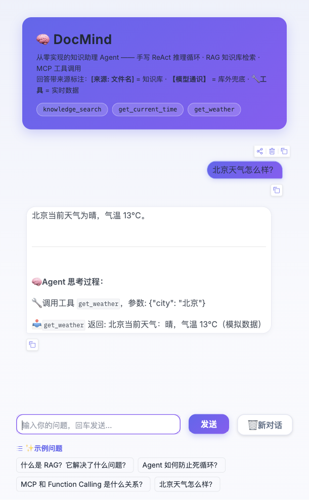

# 🧠 DocMind

> 从零实现的知识助理 Agent：**手写 ReAct 循环 + RAG 知识库检索 + MCP 工具调用 + Gradio 界面**
>
> 不依赖 LangChain / LlamaIndex，Agent 核心完全手写，便于理解与面试讲解。



## 架构

```
用户提问
   │
   ▼
ReActAgent（手写推理循环）──────────► 通义千问（百炼 API，OpenAI 兼容模式）
   │  function calling
   ▼
ToolRegistry（统一工具注册表）
   ├── knowledge_search   ──► RAG：切片 → Embedding → 余弦检索 → 引用溯源
   ├── get_current_time   ──► 本地工具示例
   └── get_weather        ──► MCP Server（stdio，官方 SDK）
```

## 快速开始

```bash
# 1. 安装依赖（Python 3.10+）
pip install -r requirements.txt

# 2. 配置 API Key
cp .env.example .env   # 填入百炼 DASHSCOPE_API_KEY

# 3. 命令行模式（调试推荐）
python -m docmind.cli

# 4. Web 界面
python -m docmind.app
```

试试这些问题：

- `DocMind 的检索流程是怎样的？`（触发 RAG 检索）
- `北京天气怎么样？`（触发 MCP 工具调用）
- `现在几点了？`（触发本地工具）

## 目录结构

```
docmind/
├── config.py              # 全局配置（.env 加载）
├── llm.py                 # 百炼 LLM / Embedding 客户端封装
├── core.py                # 应用装配（接线图）
├── cli.py                 # 命令行入口
├── app.py                 # Gradio Web 界面
├── agent/
│   ├── tools.py           # 工具注册表（统一本地/MCP 工具）
│   └── react_agent.py     # 手写 ReAct 循环（核心）
├── rag/
│   ├── chunker.py         # 文档加载与切片
│   └── vector_store.py    # 内存向量库（numpy 余弦检索）
└── mcp_client.py          # MCP 客户端（stdio 连接 + 工具转发）

mcp_servers/
└── weather_server.py      # 示例 MCP Server（FastMCP，天气查询）

docs/knowledge/            # 知识库文档（.md/.txt，启动时自动建索引）
```

## 关键设计（面试讲解点）

| 设计 | 说明 |
|---|---|
| 为什么手写 Agent 而不用 LangChain | 核心循环不足百行，手写可完全掌控上下文与异常处理，且能讲清原理 |
| 防死循环 | ① `MAX_AGENT_STEPS` 步数上限 ② 连续重复调用检测并打断 |
| 工具异常处理 | 异常不抛出，转为观察结果喂回 LLM，让模型自我纠正 |
| 向量库选型 | 小规模用内存 numpy 暴力检索；`search()` 接口稳定，可平滑换 Chroma/Milvus |
| 切片策略 | 500 字滑窗 + 80 字重叠，优先段落边界，防语义截断 |
| 防幻觉 | Prompt 强制"先检索后回答"，回答附来源标注 |

## 路线图

- [ ] 混合检索（BM25 + 向量）与 Rerank
- [ ] PDF / Word 文档支持
- [ ] 向量索引持久化缓存
- [ ] 对话日志与调用链追踪（Langfuse）
- [ ] Docker 一键部署

## License

MIT
