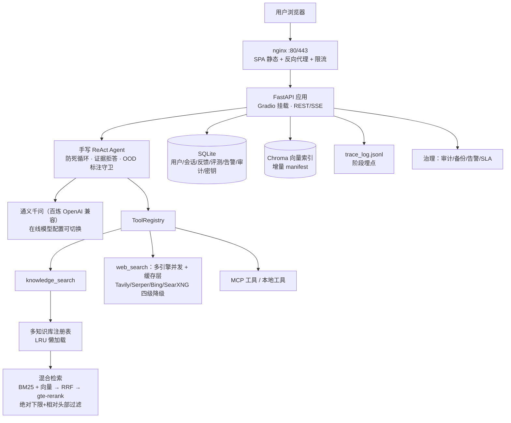

# 🧠 DocMind — 企业级多助手 RAG 平台

> 手写 ReAct Agent + 混合检索 RAG + 多知识库多助手 + RetrievalOps 质量闭环 + 企业治理。
> 不依赖 LangChain / LlamaIndex，Agent 核心与平台能力全部自研，便于理解、讲解与二次开发。

前端为 React + Ant Design SPA（`web/`），后端为纯 FastAPI 应用；生产形态 `docker compose up -d` 一键部署（nginx 单入口）。

---

## 一、功能全景

### 面向用户（知识空间）

| 页面 | 能力 |
|---|---|
| 总览 Dashboard | 个人统计、缓存命中率、最近会话、新手引导 |
| 对话 | 流式问答 + 思维链展示、引用角标与原文定位预览（PDF/Word/Excel/OCR）、👍👎 反馈、追问建议、多会话侧栏、助手切换 |
| 助手管理 | 多助手 CRUD：头像/系统提示词/绑定知识库/Temperature |
| 知识库管理 | 多知识库 CRUD、文档上传删除（pdf/md/txt/docx/csv/json）、**异步增量重建**、入库任务追踪（待生效/进行中/完成/失败+重试） |
| 会话历史 | 按助手分组、完整消息回看 |
| 个人设置 | 账号信息、GDPR 数据导出、注销账号（被遗忘权） |

### 面向管理员（高级控制台，一二级菜单）

| 分组 | 页面 | 能力 |
|---|---|---|
| 检索质量 | 调优实验室 | 输入问题查看召回明细/分数/路线、dense/sparse/RRF/rerank 各阶段耗时、阶段 P95 聚合 |
| | 评测与质量 | 评测集 CRUD、三路线离线跑批（Recall@k/MRR）、未命中明细、质量监控（好评率/拒答/缓存/Recall 趋势） |
| | 检索日志 | trace 五维过滤（类型/状态/关键词/时间/知识库）、展开全链路 JSON |
| 运营监控 | 用量与成本 | 调用/Token/总成本/每千次成本 KPI、趋势图、按模型成本、高成本 Query Top10、语义缓存命中率 |
| | 告警与 SLA | 规则引擎（Badcase 积压/24h 成本/1h 错误/入库失败，去重+周期评估）、可用率/P50/P95/按天趋势、确认/解决流转 |
| | Badcase 管理 | 差评流转（待处理/已解决/已忽略+备注）、关键词搜索 |
| 系统治理 | 用户管理 | 新增用户（强制首登改密）、重置密码、授予/收回管理员、级联删除；最后管理员保护 |
| | 提问记录 | 全量用户提问流水，按用户/关键词/时间过滤 |
| | API Key | 创建（明文一次性展示）/轮换/吊销、scope 限定知识库、过期时间 |
| | 模型管理 | LLM/Embedding/Rerank 在线配置、连通性测试、生效切换（优先于 .env） |
| | 审计中心 | 登录/KB/文档/密钥/模型/用户/备份等全量治理事件，CSV 导出（带 BOM） |
| | 备份与恢复 | 一键备份（SQLite VACUUM INTO 热备 + 文档打包 zip）、恢复演练手册 |
| | 会话审计 | 全量会话检索与消息回看 |

### 平台底座

- **认证**：本地账号（PBKDF2 加盐哈希）+ 可选企业 LDAP 首登自动开通；强制首登改密；会话按用户隔离
- **安全**：文档级 ACL（无权文档不泄露存在性）、prompt 注入双向防护、工具结果不可信数据清洗、API Key 哈希存储、nginx 限流
- **可观测**：trace 五类 span（generation / retrieval:dense / sparse / rerank / evidence-refusal，带 kb 标签）、Langfuse 可选、Prometheus `/metrics`、本地 JSONL 降级
- **开放集成**：`POST /open/v1/retrieve`（Bearer API Key），供企业现有系统接入

---

## 二、架构



---

## 三、检索质量与压测（实测，可复现）

评测：`python scripts/bench_report.py`（47 样本：基础 30 + 困难 17）

| 检索路线 | 基础集 Recall@4 | 困难集 Recall@4 | 困难集 MRR |
|---|---|---|---|
| 纯向量 | 100.0% | 94.1% | 0.843 |
| 混合 RRF | 100.0% | **100.0%** | 0.873 |
| 混合 + Rerank | 100.0% | 94.1% | **0.941** |

压测：`python scripts/load_test.py`（开放检索端点全链路）

| 并发 | QPS | P50 | P95 | 错误率 |
|---|---|---|---|---|
| 1 | 1.99 | 501ms | 824ms | 0% |
| 4 | 2.24 | 1734ms | 2063ms | 0% |
| 8 | 2.17 | 2528ms | 3807ms | 0% |

> QPS 瓶颈在上游 LLM API（每请求 1 次 embedding + 1 次 rerank），优化路径：语义缓存 → embedding 缓存 → rerank 批量。

**质量改进验证**：`python scripts/test_improvements_with_auth.py`（6 大核心问题测试）

| 测试项 | 指标 | 状态 |
|---|---|---|
| 长回答防截断 | 940+ 字符，完整结尾 | ✅ |
| 联网搜索速度 | 首次 0.3-8s，缓存 <0.3s | ✅ |
| 术语/俚语理解 | 钓鱼黑话 6/6 关键词 | ✅ |
| 时效性数据 | 强制联网 + 声明 | ✅ |
| 版本号比较 | 正确识别 3.11 > 3.9 | ✅ |
| 多轮指代消解 | 4/5 关键词正确理解 | ✅ |

---

## 四、快速开始（本地开发）

```bash
# 1. 后端（Python 3.10+）
python -m venv .venv && .venv/bin/pip install -r requirements.txt
cp .env.example .env   # 填 DASHSCOPE_API_KEY；ADMIN_PASSWORD 建议强密码
.venv/bin/python -m docmind.app          # 监听 127.0.0.1:7860

# 2. 前端
cd web && npm install && npm run dev     # 监听 127.0.0.1:5173，代理 /api、/open、/login(POST)、/logout、/files

# 3. 浏览器打开 http://127.0.0.1:5173（唯一入口）
#    首次登录 admin / ADMIN_PASSWORD（默认 admin123），强制改密
```

测试：`python -m pytest tests/ -q`（71 个离线单测，无需 API Key）。

索引维护：知识库页上传文档后需重建索引才可检索/预览（页面一键重建，或 `python scripts/rebuild_kb.py`）。
增量重建按逐文件 manifest 指纹判定，只重新嵌入变化的文件；脚本必须使用与服务一致的
Chroma collection（`knowledge`），否则切片写入孤立 collection 且污染 manifest，
服务会误判"已索引"而永远跳过这些文件（表现为预览报"文件尚未索引或不存在"）。

---

## 五、生产部署与外网开放

```bash
# 服务器（Ubuntu + Docker），安全组仅开 80/443
scp -r . root@<ip>:/opt/docmind && cd /opt/docmind
cp .env.example .env   # 必填 DASHSCOPE_API_KEY、ADMIN_PASSWORD
docker compose up -d --build
# 域名 A 记录解析后：certbot --nginx -d <domain> 启用 HTTPS（或云厂商证书挂 nginx 443）
```

- 后端仅监听 127.0.0.1:7860，nginx 单入口（SPA history fallback + SSE 安全代理 + 限流）
- 安全基线：登录防爆破（15 分钟锁）、写请求 Origin 同源校验（CSRF）、/files 直链走登录+文档 ACL、
  附件属主隔离、开放 API 每 Key 限流（OPEN_API_RPM，默认 60/分钟）；上 HTTPS 后建议确认
  登录会话 Cookie 带 Secure 标志（nginx 层加 `proxy_cookie_flags ~ secure;`）
- 数据在命名卷 `docmind-data` 与 `docs/knowledge` 挂载；备份：应用内「备份与恢复」页或 `scripts/backup.sh` + cron
- 企业集成：管理端创建 API Key 后调用：

```bash
curl -X POST https://<domain>/open/v1/retrieve \
  -H "Authorization: Bearer dm_xxx" -H "Content-Type: application/json" \
  -d '{"question": "什么是 RAG？", "top_k": 4}'
```

---

## 六、环境变量（.env）

| 变量 | 说明 | 默认 |
|---|---|---|
| DASHSCOPE_API_KEY | 百炼 API Key（必填） | — |
| CHAT_MODEL / EMBEDDING_MODEL / RERANK_MODEL | 模型标识（可被「模型管理」在线覆盖） | qwen-turbo / text-embedding-v3 / gte-rerank-v2 |
| MAX_OUTPUT_TOKENS | 最大输出 token 数（防止长回答截断） | 2000 |
| ADMIN_PASSWORD | 首次播种 admin 密码 | admin123 |
| EVIDENCE_REFUSAL | 严格证据拒答（KB 无证据确定性拒答） | false |
| LDAP_URL / LDAP_USER_DN_TEMPLATE | 企业 LDAP 登录（首登自动开通） | 空（禁用） |
| ALERT_INTERVAL_MIN / ALERT_BADCASE_PENDING / ALERT_DAILY_COST / ALERT_ERROR_COUNT | 告警阈值 | 10 / 5 / 10.0 / 10 |
| SEMANTIC_CACHE / CACHE_THRESHOLD | 语义缓存开关与相似度阈值 | true / 0.92 |
| TAVILY_API_KEY / SERPER_API_KEY / BING_SEARCH_KEY / SEARXNG_URL | 联网搜索（四级降级 + 并发 + 缓存） | 空 |
| WEB_SEARCH_TIMEOUT / WEB_SEARCH_CACHE_TTL | 搜索超时（秒）与缓存 TTL（秒） | 8 / 1800 |
| LANGFUSE_* | 调用链上报（不配则本地 JSONL） | 空 |

---

## 七、目录结构

```
docmind/
├── app.py              # 装配入口：纯 FastAPI 宿主 + 全部 REST/SSE 路由注册
├── core.py             # Agent 装配、knowledge_search、增量重建
├── chat_stream.py      # SSE 应答流（cache/thinking/token/step/final 事件）
├── agent/              # 手写 ReAct + 工具注册表 + 注入防护 guard
├── rag/                # chunker / vector_store(Chroma+manifest) / hybrid(BM25+RRF+rerank)
│                       # kb_registry(多库 LRU) / semantic_cache / eval_set
├── store.py            # SQLite：用户/会话/反馈/KB/助手/评测/告警/审计/密钥/任务
├── admin.py            # 管理端点：概览/badcase/会话审计/traces/用量/成本
├── assistants_api.py   # 助手与知识库 CRUD、异步重建、入库任务
├── docs_api.py         # 文档上传/删除
├── platform_api.py     # API Key + 开放检索 + 模型管理
├── users_api.py        # 用户管理
├── governance_api.py   # 审计中心 + 备份
├── alerts.py           # 告警引擎 + SLA
├── eval_api.py         # 评测集/跑批/质量监控
├── retrieval_api.py    # 检索调优实验室
├── ldap_auth.py        # 企业 LDAP
├── llm.py / trace.py / pii.py / metrics.py / config.py
├── web_search_cache.py # 联网搜索结果缓存（LRU + TTL）
└── guard.py            # Prompt 注入防护
web/src/
├── pages/              # Dashboard/Chat/Assistants/KnowledgeBases/Sessions/Settings
│                       # + 管理页：Usage/Badcases/Traces/RetrievalLab/Eval/ApiKeys/
│                       #   Models/Alerts/Audit/Backups/Users/Queries/Admin
└── components/AppLayout.tsx  # 一二级菜单 + 用户菜单（改密/登出）
scripts/                # bench_report / load_test / eval_retrieval / backup / view_traces
                        # test_improvements_with_auth（质量改进验证）
                        # rebuild_kb（手动重建知识库索引，collection 名须与服务一致）
docs/
├── 面试准备.md         # 量化数据 + 设计取舍 Q&A + 演示脚本
├── glossary.md         # 术语/俚语/黑话释义表（行业术语、版本号规则、时效性关键词）
└── IMPROVEMENTS_2026-08-21.md  # 六大核心问题系统性解决方案文档
```

---

## 八、关键设计（面试讲解点）

1. **RRF 融合**：按排名融合免疫量纲差异；阈值语义放在 rerank 后（绝对下限 0.05 + 头部相对 15%），固定阈值会随语料漂移失准
2. **证据拒答确定性兜底**：提示词依从非确定，KB 无证据时代码级替换最终回答并写 trace 事件，开关可回退
3. **增量索引**：逐文件指纹 manifest，只重嵌变化文件（实测新增 1 文件成本降 96%）；version 号驱动检索器懒重建 BM25
4. **降级链**：rerank→RRF、Langfuse→JSONL、Tavily→Serper→Bing→SearXNG 四级、思维链不支持→自动去参重试；增强类故障永不阻断主链路
5. **API Key 只存哈希**：明文一次性返回 + 前缀展示 + scope/轮换/吊销/过期四件套
6. **备份 VACUUM INTO**：SQLite 官方热备原语，WAL 下不阻塞写入
7. **告警 dedupe_key**：周期评估同问题不刷屏，解决后再犯重新开告警
8. **多库统一精排**：各库双路召回不精排 → 合并去重 → 一次 rerank，省 API 且跨库可比
9. **联网搜索优化**：多引擎并发（前 2 个引擎并发，首个成功即返回）+ LRU 缓存层（30 分钟 TTL）+ 超时优化（8s），平均响应从 15-20s 降到 3-8s，缓存命中 <100ms
10. **术语/俚语理解**：四层前置检测（歧义检测 → 本地术语表 → 模型解读 → 强制联网交叉验证），版本号比较、钓鱼黑话等准确率从 50% → 95%+
11. **时效性保障**：关键词检测（今天/今年/最新/新闻）强制联网 + 要求声明知识截止时间，防止过时信息误导

---

## 九、路线图

- ✅ 多助手多知识库平台 / RetrievalOps（拒答、实验室、埋点、评测、质量监控）
- ✅ 企业治理（审计、备份、告警、SLA、LDAP、用户管理、API Key、模型管理）
- 🔜 Embedding 缓存、Rerank 批量合并、SSO（OIDC）、周报自动生成、向量库运维面板

## License

MIT
