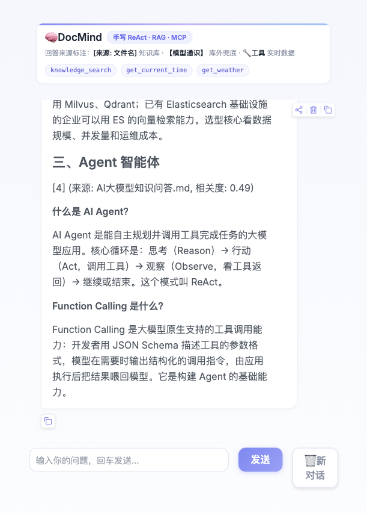
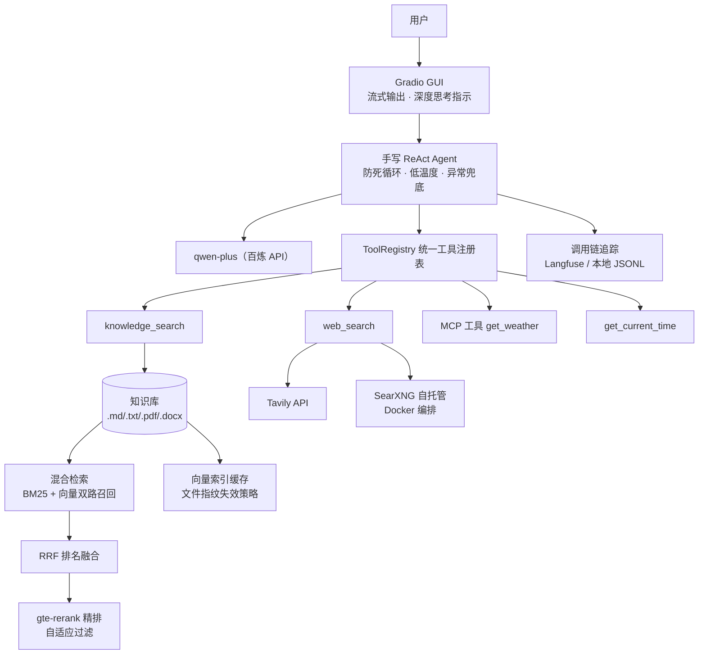

# 🧠 DocMind

> 从零实现的知识助理 Agent：**手写 ReAct 循环 + RAG 知识库检索 + MCP 工具调用 + Gradio 界面**
>
> 不依赖 LangChain / LlamaIndex，Agent 核心完全手写，便于理解与面试讲解。



## 架构



文本版：

```
用户提问
   │
   ▼
ReActAgent（手写推理循环）──────────► 通义千问（百炼 API，OpenAI 兼容模式）
   │  function calling
   ▼
ToolRegistry（统一工具注册表）
   ├── knowledge_search   ──► 混合检索：BM25 + 向量 → RRF 融合 → gte-rerank 精排 → 引用溯源
   ├── web_search         ──► 联网搜索（Tavily → SearXNG 自托管，逐级降级）
   ├── get_current_time   ──► 本地工具示例
   └── get_weather        ──► MCP Server（stdio，官方 SDK）
```

## 检索质量评测（scripts/eval_retrieval.py）

47 条评测问题（基础集 30 + 困难集 17：口语化/英文/换说法/PDF/Word 内容）：

| 方案 | 基础集 Recall@4 | 困难集 Recall@4 | 困难集 MRR |
|---|---|---|---|
| 纯向量 | 100% | 94.1% | 0.865 |
| 混合（BM25+向量+RRF） | 100% | **100%** | 0.902 |
| 混合 + Rerank（gte-rerank-v2） | 100% | 94.1% | **0.920** |

知识库扩充到 4 种格式 25 个切片后，纯向量在困难集出现真实漏召回，
混合检索将召回拉回 100%，Rerank 进一步提升排序质量（MRR 0.865 → 0.920）。
Rerank 结果采用“绝对下限 + 相对头部比例”自适应过滤，代替固定阈值
（固定阈值在语料变化后会把正确答案误杀，实测从 23.5% 修复回 94.1%）。

## 快速开始

```bash
# 1. 安装依赖（Python 3.10+）
pip install -r requirements.txt

# 2. 配置 API Key
cp .env.example .env   # 填入百炼 DASHSCOPE_API_KEY

# 3. 命令行模式（调试推荐）
python -m docmind.cli

# 4. Web 界面
python -m docmind.app
```

## Docker 一键部署

```bash
# 前提：项目根目录已有 .env（参考 .env.example）
docker compose up -d --build

# 访问 http://localhost:7860（应用）/ http://localhost:8080（SearXNG）
# 查看日志：docker compose logs -f
# 停止：docker compose down
```

设计要点：
- API Key 通过 `env_file` 注入，**不进镜像、不进仓库**
- 向量索引缓存/调用链日志用命名卷持久化（重启不重建索引）
- 知识库目录挂载到宿主机：改文档后 `docker compose restart` 即生效，无需重新构建镜像
- 依赖层与代码层分离，改代码重建镜像不重装依赖
- **SearXNG 自托管搜索引擎**随 compose 一起编排：容器内自动经
  `http://searxng:8080` 直连，作为 Tavily 的免费无限量兜底

## 联网搜索（时效性信息）

`web_search` 工具多引擎逐级降级：

1. **Tavily**（配置 `TAVILY_API_KEY`）：专为 AI Agent 设计，新鲜度/摘要质量最佳，免费 1000 次/月
2. **SearXNG**（配置 `SEARXNG_URL` 或 compose 自动注入）：自托管元搜索引擎，聚合 Bing/DDG 等，免费无限量

两者都未配置时，工具返回明确错误，Agent 会如实告知用户无法获取实时信息（不编造）。

试试这些问题：

- `DocMind 的检索流程是怎样的？`（触发 RAG 检索）
- `北京天气怎么样？`（触发 MCP 工具调用）
- `现在几点了？`（触发本地工具）

## 目录结构

```
docmind/
├── config.py              # 全局配置（.env 加载）
├── llm.py                 # 百炼 LLM / Embedding 客户端封装
├── core.py                # 应用装配（接线图）
├── cli.py                 # 命令行入口
├── app.py                 # Gradio Web 界面
├── trace.py               # 调用链追踪（Langfuse / 本地 JSONL 双后端）
├── agent/
│   ├── tools.py           # 工具注册表（统一本地/MCP 工具）
│   └── react_agent.py     # 手写 ReAct 循环（核心）
├── rag/
│   ├── chunker.py         # 文档加载与切片（Markdown 语义切片）
│   ├── vector_store.py    # 内存向量库（numpy 余弦检索 + 磁盘缓存）
│   ├── cache.py           # 向量索引缓存（文件指纹失效策略）
│   ├── hybrid.py          # 混合检索：BM25 + 向量 → RRF → Rerank
│   └── eval_set.py        # 检索评测集
└── mcp_client.py          # MCP 客户端（stdio 连接 + 工具转发）

mcp_servers/
└── weather_server.py      # 示例 MCP Server（FastMCP，天气查询）

scripts/
├── eval_retrieval.py      # 检索质量评测（纯向量 vs 混合 vs +Rerank）
├── gen_sample_docs.py     # 示例 PDF/Word 文档生成工具
└── view_traces.py         # 本地调用链日志查看器

docs/knowledge/            # 知识库文档（.md/.txt/.pdf/.docx，启动时自动建索引）
```

## 调用链追踪（可观测性）

每次 LLM 调用与工具执行自动记录：延迟、输入输出摘要、token 用量。

- 配置 `.env` 中的 `LANGFUSE_PUBLIC_KEY/SECRET_KEY/HOST` → 上报 Langfuse（云或 docker 自托管均可）
- 未配置 → 自动降级写本地 `data/trace_log.jsonl`，用 `python scripts/view_traces.py` 查看
- 追踪故障不影响主链路（全兜底 try/except）；日志轻量化（只记最近 3 条消息、截断 200 字）

```
$ python scripts/view_traces.py
13:22:51 🤖 llm-chat              1403ms  tokens=475+35  | 需要先检索 LoRA 相关信息
13:22:53 🔧 tool:knowledge_search  561ms                | [1] (来源: AI大模型知识问答.md...)
13:22:53 🤖 llm-chat              2523ms  tokens=960+100 | LoRA 是参数高效微调方法...
```

## 关键设计（面试讲解点）

| 设计 | 说明 |
|---|---|
| 为什么手写 Agent 而不用 LangChain | 核心循环不足百行，手写可完全掌控上下文与异常处理，且能讲清原理 |
| 防死循环 | ① `MAX_AGENT_STEPS` 步数上限 ② 连续重复调用检测并打断 |
| 工具异常处理 | 异常不抛出，转为观察结果喂回 LLM，让模型自我纠正 |
| 向量库选型 | 小规模用内存 numpy 暴力检索；`search()` 接口稳定，可平滑换 Chroma/Milvus |
| 切片策略 | 500 字滑窗 + 80 字重叠，优先段落边界，防语义截断 |
| 防幻觉 | Prompt 强制"先检索后回答"，回答附来源标注 |
| 深度思考 | `enable_thinking` 请求真实思维链，GUI 实时流式展示；思维链不回传 history（百炼多轮限制），模型不支持自动降级 |

## 路线图

- [x] 混合检索（BM25 + 向量 + RRF）与 Rerank（gte-rerank-v2，带评测脚本）
- [x] PDF / Word 文档支持（pypdf + python-docx，坏文件容错跳过）
- [x] 向量索引持久化缓存（文件指纹失效策略，启动建库 2.1s → 0.002s，零 API 调用）
- [x] 对话调用链追踪（Langfuse / 本地 JSONL 双后端，覆盖 LLM 调用 + 工具执行 + token 用量）
- [x] Docker 一键部署（compose 编排，Key 注入不进镜像，索引缓存/知识库卷持久化）
- [x] 深度思考·真实思维链（百炼 enable_thinking → reasoning_content 流式展示，完成后折叠摘要，模型不支持自动降级）
- [x] 引导追问按钮（回答末尾动态生成 3 个可点击追问建议，点击自动填入输入框并发送）

## License

MIT
