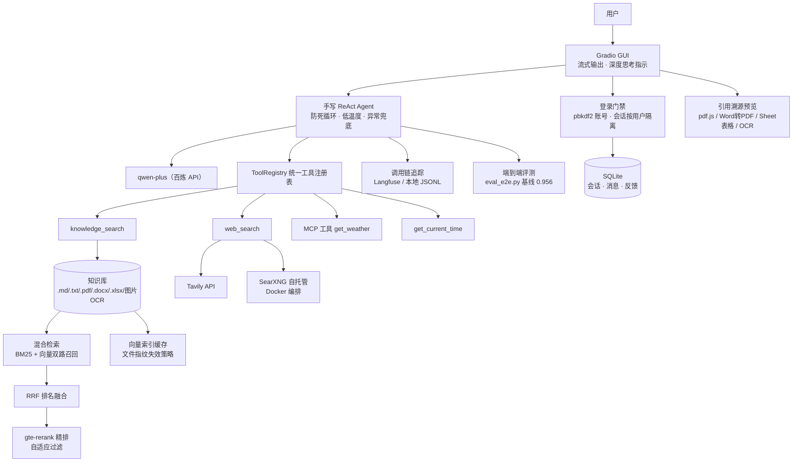

# 🧠 DocMind

> 从零实现的知识助理 Agent：**手写 ReAct 循环 + RAG 知识库检索 + MCP 工具调用 + Gradio 界面**
>
> 不依赖 LangChain / LlamaIndex，Agent 核心完全手写，便于理解与面试讲解。


## 架构



文本版：

```
用户提问
   │
   ▼
ReActAgent（手写推理循环）──────────► 通义千问（百炼 API，OpenAI 兼容模式）
   │  function calling
   ▼
ToolRegistry（统一工具注册表）
   ├── knowledge_search   ──► 混合检索：BM25 + 向量 → RRF 融合 → gte-rerank 精排 → 引用溯源
   ├── web_search         ──► 联网搜索（Tavily → SearXNG 自托管，逐级降级）
   ├── get_current_time   ──► 本地工具示例
   └── get_weather        ──► MCP Server（stdio，官方 SDK）
```

## 检索质量评测（scripts/eval_retrieval.py）

47 条评测问题（基础集 30 + 困难集 17：口语化/英文/换说法/PDF/Word 内容）：

| 方案 | 基础集 Recall@4 | 困难集 Recall@4 | 困难集 MRR |
|---|---|---|---|
| 纯向量 | 100% | 94.1% | 0.865 |
| 混合（BM25+向量+RRF） | 100% | **100%** | 0.902 |
| 混合 + Rerank（gte-rerank-v2） | 100% | 94.1% | **0.920** |

知识库扩充到 7 种格式（含 xlsx / 图片 OCR）28 个切片后，纯向量在困难集出现真实漏召回，
混合检索将召回拉回 100%，Rerank 进一步提升排序质量（MRR 0.865 → 0.920）。
Rerank 结果采用“绝对下限 + 相对头部比例”自适应过滤，代替固定阈值
（固定阈值在语料变化后会把正确答案误杀，实测从 23.5% 修复回 94.1%）。

## 快速开始

```bash
# 1. 安装依赖（Python 3.10+）
pip install -r requirements.txt

# 2. 配置 API Key
cp .env.example .env   # 填入百炼 DASHSCOPE_API_KEY

# 3. 命令行模式（调试推荐）
python -m docmind.cli

# 4. Web 界面
python -m docmind.app
```

首次启动自动创建账号 `admin`（密码取 `ADMIN_PASSWORD` 环境变量，默认 `admin123`），
登录后访问。账号管理：

```bash
python -m docmind.manage_users add <用户名> <密码>     # 新增
python -m docmind.manage_users reset <用户名> <密码>   # 改密
python -m docmind.manage_users list                    # 列表
```

## Docker 一键部署

```bash
# 前提：项目根目录已有 .env（参考 .env.example）
docker compose up -d --build

# 访问 http://localhost:7860（应用）/ http://localhost:8080（SearXNG）
# 查看日志：docker compose logs -f
# 停止：docker compose down
```

设计要点：
- API Key 通过 `env_file` 注入，**不进镜像、不进仓库**
- 向量索引缓存/调用链日志用命名卷持久化（重启不重建索引）
- 知识库目录挂载到宿主机：改文档后 `docker compose restart` 即生效，无需重新构建镜像
- 依赖层与代码层分离，改代码重建镜像不重装依赖
- **SearXNG 自托管搜索引擎**随 compose 一起编排：容器内自动经
  `http://searxng:8080` 直连，作为 Tavily 的免费无限量兜底
- Word 原文预览依赖 LibreOffice（镜像内安装 `libreoffice-core --no-install-recommends`）；
  未安装时自动降级文本预览，不影响其余功能

## 联网搜索（时效性信息）

`web_search` 工具多引擎逐级降级：

1. **Tavily**（配置 `TAVILY_API_KEY`）：专为 AI Agent 设计，新鲜度/摘要质量最佳，免费 1000 次/月
2. **SearXNG**（配置 `SEARXNG_URL` 或 compose 自动注入）：自托管元搜索引擎，聚合 Bing/DDG 等，免费无限量

两者都未配置时，工具返回明确错误，Agent 会如实告知用户无法获取实时信息（不编造）。

试试这些问题：

- `DocMind 的检索流程是怎样的？`（触发 RAG 检索）
- `北京天气怎么样？`（触发 MCP 工具调用）
- `现在几点了？`（触发本地工具）

## 目录结构

```
docmind/
├── config.py              # 全局配置（.env 加载）
├── llm.py                 # 百炼 LLM / Embedding 客户端封装
├── core.py                # 应用装配（接线图）
├── cli.py                 # 命令行入口
├── app.py                 # Gradio Web 界面（含预览弹窗/侧边栏等前端注入脚本）
├── store.py               # SQLite 存储（用户/会话/消息/反馈，pbkdf2 认证）
├── manage_users.py        # 账号管理 CLI
├── eval_e2e.py            # 端到端评测（真实链路评分 + 报告）
├── trace.py               # 调用链追踪（Langfuse / 本地 JSONL 双后端）
├── mermaid.min.js         # vendored mermaid（避 CDN）
├── vendor/pdf*.js         # vendored pdf.js（预览用，避 CDN）
├── agent/
│   ├── tools.py           # 工具注册表（统一本地/MCP 工具）
│   └── react_agent.py     # 手写 ReAct 循环（核心）
├── rag/
│   ├── chunker.py         # 文档加载与切片（7 格式：md/txt/pdf/docx/xlsx/图片OCR）
│   ├── vector_store.py    # 内存向量库（numpy 余弦检索 + 磁盘缓存）
│   ├── cache.py           # 向量索引缓存（文件指纹 + schema 版本失效）
│   ├── hybrid.py          # 混合检索：BM25 + 向量 → RRF → Rerank
│   └── eval_set.py        # 检索评测集（47 题）
└── mcp_client.py          # MCP 客户端（stdio 连接 + 工具转发）

mcp_servers/
└── weather_server.py      # 示例 MCP Server（FastMCP，天气查询）

scripts/
├── eval_retrieval.py      # 检索质量评测（纯向量 vs 混合 vs +Rerank）
├── gen_sample_docs.py     # 示例 PDF/Word 文档生成工具
└── view_traces.py         # 本地调用链日志查看器

docs/knowledge/            # 知识库文档（.md/.txt/.pdf/.docx/.xlsx/图片，启动时自动建索引；图片走 OCR）
```

## 调用链追踪（可观测性）

每次 LLM 调用与工具执行自动记录：延迟、输入输出摘要、token 用量。

- 配置 `.env` 中的 `LANGFUSE_PUBLIC_KEY/SECRET_KEY/HOST` → 上报 Langfuse（云或 docker 自托管均可）
- 未配置 → 自动降级写本地 `data/trace_log.jsonl`，用 `python scripts/view_traces.py` 查看
- 追踪故障不影响主链路（全兜底 try/except）；日志轻量化（只记最近 3 条消息、截断 200 字）

```
$ python scripts/view_traces.py
13:22:51 🤖 llm-chat              1403ms  tokens=475+35  | 需要先检索 LoRA 相关信息
13:22:53 🔧 tool:knowledge_search  561ms                | [1] (来源: AI大模型知识问答.md...)
13:22:53 🤖 llm-chat              2523ms  tokens=960+100 | LoRA 是参数高效微调方法...
```

## 关键设计（面试讲解点）

| 设计 | 说明 |
|---|---|
| 为什么手写 Agent 而不用 LangChain | 核心循环不足百行，手写可完全掌控上下文与异常处理，且能讲清原理 |
| 防死循环 | ① `MAX_AGENT_STEPS` 步数上限 ② 连续重复调用检测并打断 |
| 工具异常处理 | 异常不抛出，转为观察结果喂回 LLM，让模型自我纠正 |
| 向量库选型 | 小规模用内存 numpy 暴力检索；`search()` 接口稳定，可平滑换 Chroma/Milvus |
| 切片策略 | Markdown 按标题语义分段、小段合并超长段拆分；其余格式 280 字滑窗 + 40 字重叠优先换行断开；PDF 按页切片携带页码元数据 |
| 防幻觉 | Prompt 强制"先检索后回答"，回答附来源标注 |
| 深度思考 | `enable_thinking` 请求真实思维链，GUI 实时流式展示；思维链不回传 history（百炼多轮限制），模型不支持自动降级 |
| 数据可视化 | Prompt 引导模型对流程/架构类问题输出 ` ```mermaid ` 图表；内联 vendored mermaid.min.js（避 CDN），前端用 `mermaid.run` 对 Gradio 生成的 `.mermaid` 容器原地渲染为 SVG |
| 引用溯源预览 | PDF 切片携带页码元数据 → 检索结果带页码 → 模型引用写成 `[来源: 文件 · 第N页]` → 前端链接化，点击弹窗预览原文（vendored pdf.js 定位到页，支持缩放/翻页/页码跳转/键盘导航；docx 经 LibreOffice 转 PDF 复用 PDF 通道，未安装降级文本预览；xlsx 解析为 Sheet 表格预览；图片预览原图 + OCR 识别文本（百炼 qwen-vl，结果磁盘缓存并入库可检索） |
| 会话持久化 | SQLite 单文件（data/chat.db，标准库零依赖）：session_id 由前端 localStorage 生成，引导脚本写入隐藏框并触发历史恢复；清空对话即开新会话 |
| 反馈闭环 | 完成的回答下 👍/👎（稳定性闸门后追加），POST /api/feedback 按 session+消息序号 upsert；刷新后 GET 恢复选中态，👎 即 badcase 收集入口 |
| 多会话侧边栏 | 标题栏「☰ 会话」抽屉：会话列表（标题/轮数/时间/当前高亮）、切换、新建、删除（带确认）。切换时服务端 reset Agent 并用 raw 干净文本重建多轮上下文——消息表 content 存渲染版、raw 存纯净终答，展示与 LLM 上下文分离 |
| 认证权限 | Gradio 原生登录门禁（launch auth）+ users 表 pbkdf2 哈希（manage_users CLI 管理）；会话按用户隔离（sessions.user 归属 + /api 路由 cookie 鉴权 401/403）；无账号自动播种 admin（ADMIN_PASSWORD 环境变量） |
| 端到端评测 | eval_e2e.py：真实链路跑评测集（来源命中 0.5 + 关键要点 0.3 + 引用格式 0.2，OOD 用例评诚实性），可选 --judge LLM 评审；报告落 data/eval/*.json |
| OOD 透明度守卫 | 评测发现 LLM 偶发漏标【知识库无相关内容】（依从性非确定）→ Agent 终答处确定性兜底：循环内跟踪 knowledge_search 是否命中（格式锚点判定，多次调用任一命中即算）、web_search 是否使用；KB 空且终答无标注时自动前置补标，联网兜底用【…基于联网检索】、否则用【…模型通识】；history 与输出同步修正，展示/落库/多轮上下文三处一致 |

## 路线图

- [x] 混合检索（BM25 + 向量 + RRF）与 Rerank（gte-rerank-v2，带评测脚本）
- [x] PDF / Word 文档支持（pypdf + python-docx，坏文件容错跳过）
- [x] Excel 解析 + 图片 OCR 入库（openpyxl 按 Sheet 切块；百炼 qwen-vl OCR 抽文字，磁盘缓存免重复调 API）
- [x] Excel/图片预览（xlsx Sheet 页签表格；图片原图 + OCR 文本对照，点击引用直达）
- [x] 会话持久化 + 反馈闭环（SQLite 存储刷新自动恢复；👍👎 评价落库，badcase 可溯源）
- [x] 多会话侧边栏（列表/切换/新建/删除；切换重建对应会话的 LLM 多轮上下文）
- [x] 认证权限（登录门禁 + pbkdf2 账号体系 + 会话按用户隔离）
- [x] 端到端评测集（真实链路评分 + OOD 诚实性 + LLM 评审 + JSON 报告）
- [x] 向量索引持久化缓存（文件指纹失效策略，启动建库 2.1s → 0.002s，零 API 调用）
- [x] 对话调用链追踪（Langfuse / 本地 JSONL 双后端，覆盖 LLM 调用 + 工具执行 + token 用量）
- [x] Docker 一键部署（compose 编排，Key 注入不进镜像，索引缓存/知识库卷持久化）
- [x] 深度思考·真实思维链（百炼 enable_thinking → reasoning_content 流式展示，完成后折叠摘要，模型不支持自动降级）
- [x] 引导追问按钮（回答末尾动态生成 3 个可点击追问建议，点击自动填入输入框并发送）
- [x] 数据可视化·Mermaid 图表（system prompt 引导生成 + 前端原地渲染 SVG；本地内联 mermaid 库避 CDN，`mermaid.run` 去重无冲突）
- [x] 文档预览·引用溯源直达（PDF 按页切片带页码元数据，引用可点击弹窗预览原文并定位到页；pdf.js vendored，docx 转 PDF/文本双通道降级）

### 下一步优化方向

**质量**
- [x] OOD 透明度标注守卫：Agent 侧确定性兜底——KB 检索为空且终答无标注时自动补标（区分通识/联网两种标注，见关键设计表）
- [ ] 结构化切片：表格/标题边界感知（xlsx 行拼接、docx 表格目前偏粗）；多轮查询改写（指代消解后再检索）
- [ ] 语义缓存：高频问题命中缓存秒回，省 token 降延迟

**安全合规**
- [ ] Prompt 注入防护（知识库文档/网页内容中的恶意指令隔离）
- [ ] 文档级 ACL：知识库按用户/角色授权（当前为登录隔离、知识库全员共享）
- [ ] 管理后台：会话审计、👎 badcase 标注流转、用量看板

**工程**
- [ ] 单元测试 + CI 冒烟（当前零测试）
- [ ] Docker 镜像补 LibreOffice、chat.db 卷挂载、健康检查

**体验**
- [ ] 动态追问：LLM 按回答内容生成针对性追问（当前为固定三问）
- [ ] 引用锚点细化：预览定位到段落/表格级高亮

## License

MIT
